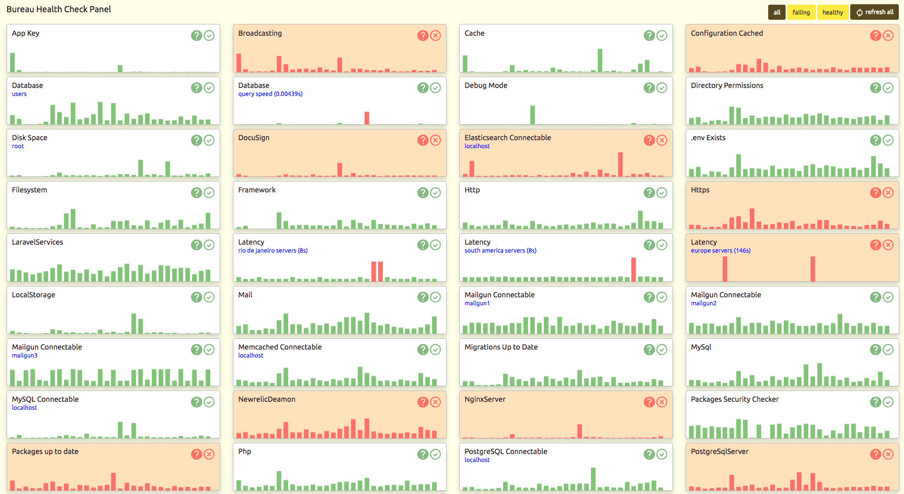
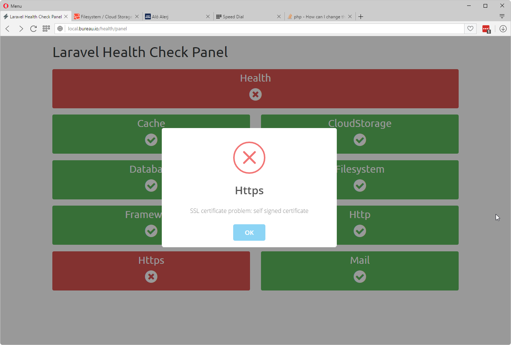
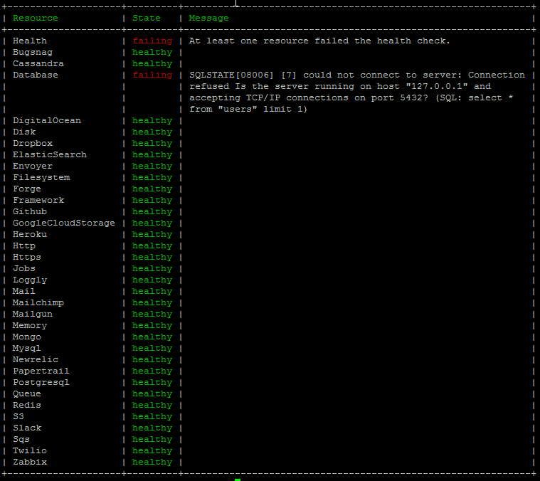

# Health Monitor
## Laravel Server & App Health Monitor and Notifier

[](https://packagist.org/packages/pragmarx/health) [](LICENSE) [](https://packagist.org/packages/pragmarx/health) [](https://scrutinizer-ci.com/g/antonioribeiro/health/?branch=master) [](https://scrutinizer-ci.com/g/antonioribeiro/health/?branch=master) [](https://scrutinizer-ci.com/g/antonioribeiro/health/?branch=master) [](https://styleci.io/repos/74829244)

This package checks if the application resources are running as they should and creates a service status panel. It has the following main points:

- Highly extensible and configurable: you can create new checkers and notifiers very easily, and you can virtually change everything on it.
- Easy configuration: uses YAML as configuration files
- Resilient resource checker: if the framework is working and at least one notification channel, you should receive notification messages. 
- Built-in notification system: get notifications via mail, slack, telegram or anything else you need.
- Routes for: panel, json result, string result and resource.
- Configurable panel design.
- Cache.
- Schedule checks to automatically receive notifications when a service fails.
- View app error messages right in the panel.
- Http response codes 200 and 500, on error, for services like [Envoyer](https://envoyer.io) to keep track of your app health.

## Built-in Resources 

Heath has pre-configured resource checkers for the following services:

- AppKey
- Broadcasting
- Cache
- ConfigurationCached
- Certificate
- Database
- DebugMode
- DirectoryPermissions
- DiskSpace
- DocuSign
- ElasticsearchConnectable
- EnvExists
- Filesystem
- Framework
- Horizon
- Http
- Https
- LaravelServices
- Latency
- LocalStorage
- Mail
- MailgunConnectable
- MemcachedConnectable
- MigrationsUpToDate
- MySql
- MySqlConnectable
- NewrelicDeamon
- NginxServer
- PackagesUpToDate
- Php
- PostgreSqlConnectable
- PostgreSqlServer
- Queue
- QueueWorkers
- RebootRequired
- Redis
- RedisConnectable
- RedisServer
- RoutesCached
- S3
- SecurityChecker
- ServerLoad
- ServerUptime
- Sshd
- Supervisor
 
But you can add anything else you need, you just have to find the right checker to use or just create a new checker for your resource. 

## Easy Configuration 

Creating new resources monitors is easy, just create a new YAML file in app's config/health folder and it's done. Here's some examples:

### Amazon S3

    name: S3
    abbreviation: s3
    checker: PragmaRX\Health\Checkers\CloudStorageChecker
    notify: true
    driver: s3
    file: pragmarx-health-s3-testfile.txt
    contents: {{ str_random(32) }}
    error_message: 'Amazon S3 connection is failing.'
    column_size: 4

### Nginx

    name: NginxServer
    abbreviation: ngnxsrvr
    checker: PragmaRX\Health\Checkers\ProcessChecker
    command: 'pgrep %s'
    method: process_count
    process_name: nginx
    instances:
        minimum:
            count: 4
            message: 'Process "%s" has not enough instances running: it has %s, when should have at least %s'
        maximum:
            count: 8
            message: 'Process "%s" exceeded the maximum number of running instances: it has %s, when should have at most %s'
    notify: true
    pid_file_missing_error_message: 'Process ID file is missing: %s.'
    pid_file_missing_not_locked: 'Process ID file is not being used by any process: %s.'
    column_size: 4

## Screenshots 

### Panel



### Panel alternate design

If you have lots of services to check, you may change the default panel design to use less space:


### Panel in 4 columns layout


### Error Messages 

Mouse over a failing resource and get instant access to the error message:


Click the resource button and you'll get an alert showing the error message:



### Slack Notification

Here's an example of notification sent via Slack:


## Artisan Console Commands

### health:panel

Use the command `health:panel` to view the status of your services in console.

### health:check

Use the command `health:check` to check all your resources and send notifications on failures.



## Routes

After installing you will have access to the following routes:

### /health/panel

The main panel route.

### /health/check

Returns a json with everything the package knows about your services:


### /health/string

Returns a string with status on all your services, useful when using other monitoring services:

```
hlthFAIL-dbFAIL-filesystemOK-frmwrkOK-httpOK-httpsOK-mailOK
```

### /health/resource/{name}

Returns a json with information about a particular service:


## Requirements

- PHP 7.1+
- Laravel 5.6+

## Installing

Use Composer to install it:

    composer require pragmarx/health

## Installing on Laravel

Add the Service Provider to your `config/app.php`:

    PragmaRX\Health\ServiceProvider::class,

## Publish config and views

    php artisan vendor:publish --provider="PragmaRX\Health\ServiceProvider"

## Hit The Health Panel

    http://yourdomain.com/health/panel
    
## Configure All The Things

Almost everything is easily configurable in this package:
 
- Panel name
- Title and messages
- Resource checkers
- Slack icon
- Notification channels
- Template location
- Routes and prefixes
- Mail server
- Cache
- Scheduler

## Configure binaries

Some of the checkers need you to configure the proper binary path for the checker to work:

    'services' => [
        'ping' => [
            'bin' => env('HEALTH_PING_BIN', '/sbin/ping'),
        ],

        'composer' => [
            'bin' => env('HEALTH_COMPOSER_BIN', 'composer'),
        ],
    ],

## Allowing Slack Notifications

To receive notifications via Slack, you'll have to setup [Incoming Webhooks](https://api.slack.com/incoming-webhooks) and add this method to your User model with your webhook: 

    /**
     * Route notifications for the Slack channel.
     *
     * @return string
     */
    public function routeNotificationForSlack()
    {
        return config('services.slack.webhook_url');
    }

## Cache

When Health result is cached, you can flush the cache to make it process all resources again by adding `?flush=true` to the url: 

    http://yourdomain.com/health/panel?flush=true

## Events

If you prefer to build you own notifications systems, you can disable it and listen for the following event  

    PragmaRX\Health\Events\RaiseHealthIssue::class

## Broadcasting Checker

Broadcasting checker is done via ping and pong system. The broadcast checker will ping your service, and it must pong back. Basically what you need to do is to call back a url with some data:

### Redis + Socket.io

    var request = require('request');
    var server = require('http').Server();
    var io = require('socket.io')(server);
    var Redis = require('ioredis');
    var redis = new Redis();
    
    redis.subscribe('pragmarx-health-broadcasting-channel');
    
    redis.on('message', function (channel, message) {
        message = JSON.parse(message);
    
        if (message.event == 'PragmaRX\\Health\\Events\\HealthPing') {
            request.get(message.data.callbackUrl + '?data=' + JSON.stringify(message.data));
        }
    });
    
    server.listen(3000);

### Pusher

    <!DOCTYPE html>
    <html>
        <head>
            <title>Pusher Test</title>
            <script src="https://js.pusher.com/3.2/pusher.min.js"></script>
            <script>
                var pusher = new Pusher('YOUR-PUSHER-KEY', {
                    encrypted: true
                });
    
                var channel = pusher.subscribe('pragmarx-health-broadcasting-channel');
    
                channel.bind('PragmaRX\\Health\\Events\\HealthPing', function(data) {
                    var request = (new XMLHttpRequest());
    
                    request.open("GET", data.callbackUrl + '?data=' + JSON.stringify(data));
    
                    request.send();
                });
            </script>
        </head>
    
        <body>
            Pusher waiting for events...
        </body>
    </html>

## Programatically checking resources

``` php
$generalHealthState = app('pragmarx.health')->checkResources();

// or 

$databaseHealthy = app('pragmarx.health')->checkResource('database')->isHealthy();
```

Checking in artisan commands example: 

```
Artisan::command('database:health', function () {
    app('pragmarx.health')->checkResource('database')->isHealthy()
        ? $this->info('database is healthy')
        : $this->info('database is in trouble')
    ;
})->describe('Check database health');
```

## Lumen
To use it on Lumen, you'll probably need to do something like this on your `bootstrap/app.php`:

    $app->instance('path.config', app()->basePath() . DIRECTORY_SEPARATOR . 'config');
    $app->instance('path.storage', app()->basePath() . DIRECTORY_SEPARATOR . 'storage');
    
    $app->withFacades();
    
    $app->singleton('Illuminate\Contracts\Routing\ResponseFactory', function ($app) {
        return new \Illuminate\Routing\ResponseFactory(
            $app['Illuminate\Contracts\View\Factory'],
            $app['Illuminate\Routing\Redirector']
        );
    });
    
    $app->register(PragmaRX\Health\ServiceProvider::class);
 
## Testing

``` bash
$ composer test
```

## Author

[Antonio Carlos Ribeiro](http://twitter.com/iantonioribeiro)

## License

Health is licensed under the BSD 3-Clause License - see the `LICENSE` file for details

## Contributing

Pull requests and issues are more than welcome.
